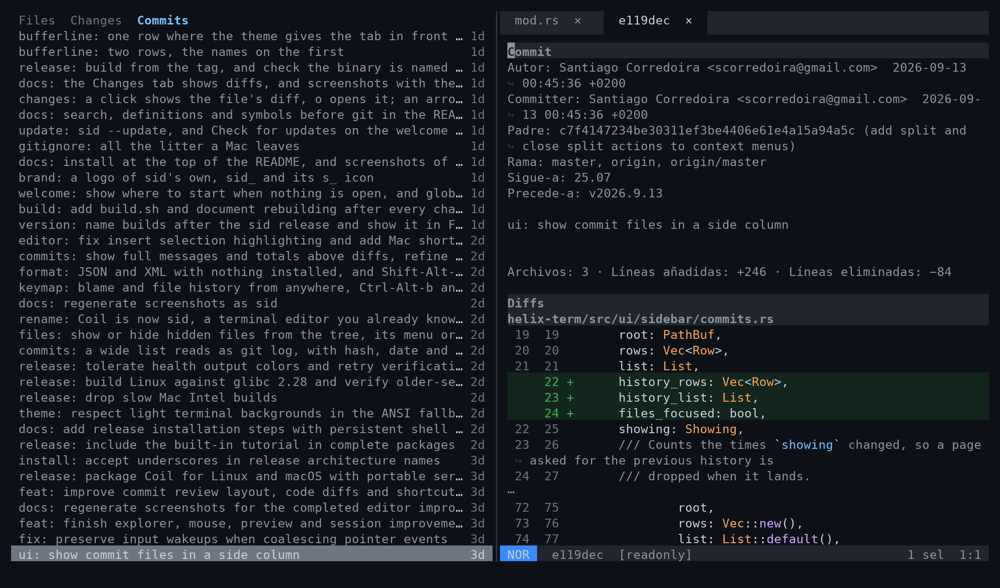
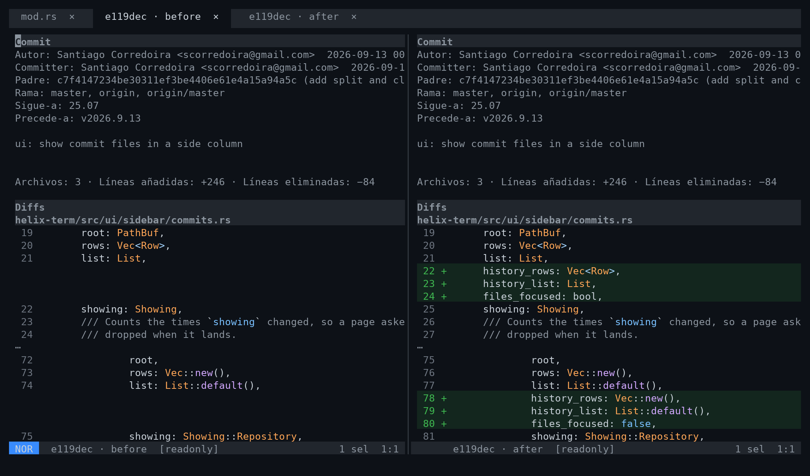
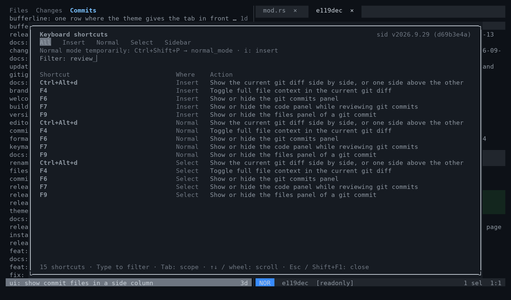

<div align="center">


**A terminal code editor you already know how to use.**

</div>

sid is a code editor that runs in the terminal and behaves like the editors on
your desktop: you open a file and type. `Ctrl-c` copies, `Ctrl-z` undoes,
`Ctrl-s` saves, `Shift` and an arrow select, the mouse clicks, scrolls and
drags. There are no modes to learn and nothing to memorise before you can
write a line.

Around the text it has what you would otherwise leave the editor for: a file
tree beside your code, git's changes, history and blame, search and replace
across the project, and Markdown rendered as it reads. Underneath there are
language servers and tree-sitter, so completion, go to definition, rename and
diagnostics work as they do in a full IDE, with highlighting for hundreds of
languages.


## Install

On macOS (Apple Silicon) or Linux (x86_64 and ARM64), with no compiler or root
access — the same two lines update it:

```sh
curl -fsSL https://raw.githubusercontent.com/scorredoira/sid/master/fork/install.sh -o /tmp/install-sid.sh
sh /tmp/install-sid.sh
```

It installs under `~/.local`: make sure `~/.local/bin` is on your PATH, then run
`sid` in a project. Later, `sid --update` installs the latest release when there
is a newer one, and so does **Check for updates** on the welcome screen
(`:check-updates`), after asking. The binaries are in the
[latest release](https://github.com/scorredoira/sid/releases/latest); a single
portable file for servers, other prefixes and building from source are under
[Installing](#installing).

## Who it is for

- **People who work in the terminal, or on machines they reach over SSH**, and
  want a real editor there without learning vim first. sid is one file to
  install, needs no compiler or runtime on the machine, and copies to your own
  clipboard across SSH in terminals that allow it.
- **People who like modern editors' keys and panels** but want something that
  starts instantly and runs anywhere a terminal does.
- **Vim and Helix users** are welcome too: modal editing is all still there,
  one setting away. It is just not what you get by default.

## Why it exists

Terminal editors tend to make you choose. The powerful ones are modal: you
learn a new way of typing before you can be productive. The simple ones are
easy but stop at editing text: no tree, no git, no language server.

sid doesn't choose. It began as a fork of [Helix](https://github.com/helix-editor/helix)
— a fast, modern modal editor with excellent language support — to keep that
engine and change everything a newcomer meets: it opens in insert mode and stays
there, uses the keys every other editor uses, and puts the tools of a desktop IDE
on the screen. By now it is a different editor, so it has a name of its own:
**sid**, short and easy to type.

## A sidebar file tree

The editor's own keys work while the sidebar has the focus, and they mean there
what they mean in the code: `Ctrl-q` quits, `Ctrl-s` saves, `Ctrl-n` opens a
buffer, `Ctrl-f` searches the file, `F2` renames a symbol. Nothing the tree does
is bound over them.

`Ctrl-b` shows or hides it and `Ctrl-e` focuses it; started on a file
(`sid foo.ts`), the editor opens without it. The tree is a column down the
left with the code beside it, always. The Changes and Commits tabs can run
across the top instead, with the code under them, both the whole width: the
setting **The code, with the changes or the commits on screen**
(`sidebar.code`, `beside` or `below`) chooses; the rule between them drags,
and where it was dragged to is kept. It follows the file you are
editing, and `Ctrl-r` takes you to that file in the tree from wherever
you are. Inside it the arrows move, `Enter`
opens, and **typing walks to the file whose name you are typing**, the way an
explorer does; `/` opens a filter on the top row instead, and the tree
narrows to every file in the project whose path contains what you type, folded
away or not, shown under the folders on the way to it — `Esc` brings the whole
tree back, folded as it was. `.` shows or hides the files that start with a dot.

What the tree does to the disk is on keys of its own, which work **wherever the
focus is** — in the tree or in the code — and act on the row the tree has
selected, or on the file you are editing when no tree is on screen:
`Ctrl-Alt-n` creates (a name with folders in it, `a/b/c.ts`, makes them; a name
that would leave the project is refused), `Ctrl-Alt-r` renames, and
`Shift-Delete` deletes. With the focus in the tree `Delete` deletes too, since
there is no text there for it to take a character from. The right button offers
the same on the row it lands on, and — on a machine with a desktop, not over
SSH — shows it in the system's file manager, as `Shift-Alt-r` does. Deleting
closes what the file had open, unsaved changes and all — the confirmation says
so — so a deleted file stays deleted instead of being written back by the next
save.

A click opens a file and the typing goes to it: a click never takes the keyboard
from the text, and a click on the text always gives it back. The tree has the
keys only when `Ctrl-e` or `Ctrl-r` asks for them, until `Esc`, `Enter`, or a
click on a file or on the text. The wheel scrolls, and dragging the line between
the tree and the editor resizes it: the width is remembered.

`Ctrl-Alt-o` takes you to an **outline** under the tree: the functions and
methods of the file you are editing. A running language server says what the
file defines, every kind of thing it knows; without one the syntax tree does, so
it works for every language sid highlights with nothing installed, and the
outline moves over to the server the moment it comes up. Either way it follows
what you type, once you pause. A click, or `Enter`, goes to the definition. The
one your cursor is inside is bold, and the outline follows the cursor as the
tree follows the file; the status line names it too, `Shape › area`, outermost
first, whether the outline is on screen or not (it is the `current-symbol`
element, for a configuration that lays out its own status line). The rule
between the two says `by position` or `by name`: a click on it turns the order
over, and dragging the rest of it resizes the panes. `Alt-↑` and `Alt-↓` move
the focus between the tree and the outline, typing walks the outline by name as
it walks the tree, and `/` narrows it to the definitions whose name contains
what you type, `Esc` bringing them all back. By position, a definition with
others inside it folds as a directory does: `←` closes it, `→` opens it,
`Shift-←` and `Shift-→` fold or unfold them all. `Ctrl-Alt-o` pressed while the
outline has the keys puts it away and gives the keys back to the code; what you
chose is remembered.

A right click on the outline offers the rest: **List every definition** adds the
types, classes, constants and the rest of what the file holds to the functions
and methods, and **Put the outline beside the tree** gives it a column of its
own to the right of the tree instead of the rows under it, with the rule between
them draggable the same way. The panel widens to make room for two columns the
first time, and both choices are remembered like the order.


The tree reads the disk off to the side, never while drawing, and it notices
what happens there: a file a tool or git creates appears on its own within a
couple of seconds, with your folds and your place kept. `F5` reads everything
on screen again at once, wherever the focus is. Inside a git repository each
row says what git says of it, dimmed at its tail: `M` modified, `A` added,
`D` deleted, `R` renamed, and a `•` on a directory with a change somewhere
inside.

## Search and replace across the project

`Ctrl-Shift-f` — or `Ctrl-f` pressed twice, which widens the search of the file to
the project — opens a panel with a replace box and
include/exclude filters (the filters are remembered), switches for case, whole
word, regex and preserving case — the panel's border says their keys — and
each result shows the line it matched. `Alt-a` replaces every match on
screen: the files are changed but left unsaved, and one undo takes it back.


## Search and replace in this file

`Ctrl-f` opens the same panel on the file you are editing, its name on the
border: the matches listed by line, the file beside them, the same switches.
`Alt-a` replaces every match in it, unsaved, and one undo takes it back.
`Ctrl-g` asks for a line number and goes there, following it as you type.


## Go to definition, references and symbols

`F12` goes to the definition of what is under the cursor and `Shift-F12` lists
its references; `F2` renames it everywhere, and `F8` walks to the next problem
the language server found. `Ctrl-o` lists the symbols of the file — a kind typed whole, `enum` or
`method`, narrows the list to that kind — and
`Ctrl-t` those of the whole project, filtered as you type — from the language
server when there is one, and from the syntax tree when there is not, so they
work on any file sid can highlight. `Ctrl-Alt-←` and `Ctrl-Alt-→` take you back
and forth through where you have been.


## What git sees changed

The **Changes** tab (`Tab` inside the sidebar) lists what `git status` names,
each file with its letter: modified, added, deleted, renamed. The letter sits in
git's own column — the left one when the change is staged, the right one when
it is not, both when it is some of each. A click on a file shows what it changed
since the last commit, staged or not, and the diff follows the cursor while it is
on screen; `Enter` or a double click goes over to read it, and `o` opens the file
itself to edit it, where the gutter marks the lines that changed.

`s` stages the file under the cursor, `u` takes it out of the index, and `d`
(or `Delete`) throws its working changes away after asking — an untracked file
is deleted, since git has nothing to get it back from, and the question says
when unsaved edits to the file in the editor would go with it. A file that is
open is read again from disk afterwards. One hunk at a time works too, from the
diff on screen or from the list: `Ctrl-Alt-s` stages the hunk under the cursor,
`Ctrl-Alt-u` takes it out of the index, and `Ctrl-Alt-x` throws it away after
asking; the right button offers the three on a line of the diff. The right button offers the same on the row it
lands on. The list is asked of git every couple of seconds while the tab is on
screen, and it stays where you scrolled it.


## The history, and each commit's diff

The **Commits** tab lists the history, with the whole width to itself until a
commit is opened. `sid -c` (or `--commits`) opens the editor on the history
alone, without the strip of tabs over it, the keys in it; outside a git
repository it says so and does not start. `Enter` or a double click opens one:
the code column comes with the commit's message and the diff of every file,
each file's diff set apart from the next with room between them, and follows
the cursor over the history. The keys stay there, so `Enter` or a double click
again puts the code away. `F9` lists the files the commit touched beside the
history as well, with the keys in them: the diff then follows whatever the
cursor is on in the files, a directory, or one file, shown on its own without
the message; `Alt-Up` brings the keys back to the history and `Alt-Down` takes
them into the files. `Esc` closes the commit and leaves the history alone
again; `F7` hides or shows
the code in between. `/` opens a filter on the top row: the history narrows to
the commits whose hash starts with what you type (`45f740db8`) or whose subject
or author contains it, looking through the whole history, not only what is on
screen — `Esc` brings it all back. The files come as a tree, folded like the
file tree, or one per line with its whole path: the setting **A commit's
files** (`sidebar.commit-files`, `tree` or `paths`) chooses, and is kept.
History sits above the changed files in one column; drag the divider to resize either pane, or its outer edge to adjust the
column width.

Diffs show filenames and highlighted code with old/new line numbers. `F4` toggles
the full historical file around the changes. The right button offers these
controls too.

`F6` walks the round of the places work is looked at from: from the code to the
tab the sidebar shows (the files, when it is closed), then the files, the
changes, the commits, and back to the code, with the sidebar left where it is.
`Shift-F6` walks it the other way. Outside a git repository the round is the
files and the code.



`Ctrl-Alt-d` puts any diff, a commit's or an uncommitted file's, side by side:
the old side on the left, the new one on the right, each line facing the line
it became. Scroll or move either side and the other follows. `Ctrl-Alt-d`
again puts one side above the other.



`Ctrl-Alt-l` narrows the history to the current file, following renames.


## Who changed this line

`Ctrl-Alt-b` says who last changed the line under the cursor, when, and in
which commit; press it again to open that commit in the sidebar.


## Markdown, as it reads

`Ctrl-Shift-b` draws the Markdown file you are editing beside it: headings,
lists and tasks, quotes and GitHub's alerts, tables lined up, code
highlighted, all reflowed to the panel. It redraws once you pause typing and
keeps to the part of the file on screen; the wheel over it scrolls it on its
own until the file moves, and dragging the line between the file and the panel
resizes it: the width is remembered. A click on a link follows it: a file opens
in the editor, a `#heading` goes to that heading, and a web address opens in
the browser. Dragging over the text selects it as the file's own text selects,
`Shift` and a click takes the selection to the pointer, and `Ctrl-c` copies
what is selected: while something in the panel is selected, the copy key copies
that.


`Ctrl-Shift-m` gives it the whole screen instead, the text in a column of its
own width, as one more tab beside the file's: closing the tab is closing the
preview. There the arrows, `PageUp` and `PageDown`, `Home` and `End` scroll it
and `Escape` closes it. The editor's own shortcuts still work; nothing else
reaches the file behind it.


## Tabs, splits and the mouse

Buffers are tabs you can click, each with a cross that closes it, and there is a
tab even when only one file is open. Right-click a tab to split its file vertically
(side by side) or horizontally (stacked), keeping the current view open, or to
close it, every other tab, or all of them.
The right button in the editor opens what can be done where it landed:
cut, copy, paste, go to the definition, rename the
symbol, or split vertically or horizontally. With more than one pane open,
**Close split** closes the pane you right-clicked, keeping its file in the tabs.


When the tabs do not all fit, the strip scrolls to keep the one you are on in
view, with `‹` and `›` at the edges where tabs are hidden: a click on one shifts
the strip by a tab, and the wheel over the tabs goes to the previous or the next
file.

In the text, a double click selects the word and a triple click the line, and
dragging from there grows the selection by words or by lines; what you type next
replaces it. `Ctrl`-click (`Cmd`-click where the terminal passes it on) goes to
the definition of what you clicked. Letting the pointer rest on a word shows what
the language server knows about it, and on a problem shows the problem first;
moving away closes it.

Opening the editor on a project — `sid`, or `sid .` — reopens what it had
open: the tabs in their order, the splits as they were and as wide as they
were, each with its cursor where it was and scrolled where it was, and the one
you were on in front. Naming a file opens that file
alone, and the settings screen turns it off altogether. Splits resize by dragging the line between two
side by side, or the status line between two stacked. In the pickers a click
previews a row and a double click opens it; the wheel over the list walks it,
and over the preview scrolls the preview.


sid holds a file whole in memory, so one past 50 MB — a database dump, a log — is
asked about before it opens, with its size. Said yes to, it opens without
highlighting, language server, git marks or line wrap, which would each walk all of
it again, and moves as fast as a small one.

## Ready as installed

**sid opens where you type.** It starts in insert mode and stays there: moving
to another file or another split no longer drops you into normal mode, and
`Escape` closes what is open rather than changing the mode you are in. Helix's
modal editing is all still here — `Ctrl-Alt-m`, or `Alt-Enter`, leaves the
typing for normal mode, the first line of the settings screen (`Ctrl-,`)
switches sid to it for good, and so does `default-mode = "normal"` under
`[editor]` — but nothing takes you to it without asking.

So the keys are the ones you already know:

| Key | Does |
|---|---|
| `Ctrl-z` / `Ctrl-y` | Undo / redo |
| `Ctrl-x` / `Ctrl-c` / `Ctrl-v` | Cut / copy / paste — the whole line when nothing is selected |
| `Ctrl-a` | Select everything |
| `Shift` + an arrow | Select while typing (`Ctrl-Shift` for whole words) |
| `Shift-PageUp` / `Shift-PageDown` | Grow the selection a screenful at a time |
| `Shift` + a click | Take the selection to where you clicked |
| `Ctrl` + `←` / `→` | Move by words |
| `Ctrl-Home` / `Ctrl-End` | To the start and the end of the file |
| `Backspace` / `Delete` | Delete the selection, or one character |
| `Ctrl-Backspace` / `Ctrl-Delete` | Delete a whole word |
| `Ctrl-d` / `Ctrl-l` | Select the word, then where it appears next — one more caret each time / every place at once |
| `Ctrl-Shift-d` / `Ctrl-Shift-k` | Duplicate / delete the line |
| `Ctrl` + `↑` / `↓` | Move the line up or down |
| `Ctrl-Shift` + `↑` / `↓` | Grow the selection to the enclosing code, and back |
| `Ctrl-/` / `Shift-Alt-a` | Comment, or uncomment / as a block |
| `Tab` / `Shift-Tab` | Indent, or unindent |
| `Ctrl-n` / `Ctrl-w` / `Shift-F4` | A new buffer / close this one / close them all |
| `Ctrl-s` / `Ctrl-Shift-s` | Save / save under a name |
| `Ctrl-p` | Open a file by name |
| `F1` / `Ctrl-Shift-p` | The command palette: every command, searchable by name or by what it does (`diff`, `git`), with its keys |
| `Shift-F1` | Every shortcut, searchable, and where each is changed |
| `Ctrl-Alt-m` / `Alt-Enter` | Leave the typing for Helix's normal mode |
| `Shift-F10` | What can be done to what the cursor is on — the menu the right button opens, for terminals that keep the right button for themselves |
| `F4` | Commit diff: full file context / changed sections |
| `Ctrl-Alt-d` | A diff side by side / one side above the other |
| `F6` / `Shift-F6` | The round: the files, the changes, the commits, the code — and back |
| `F7` / `F9` | Show or hide the code column / a commit's files |
| `F5` | Read the sidebar again |
| `Ctrl-Alt-s` / `Ctrl-Alt-u` / `Ctrl-Alt-x` | Stage / unstage / discard the hunk under the cursor of an uncommitted diff |
| `Ctrl-Alt-b` / `Ctrl-Alt-l` | Who changed this line / this file's history |
| `Ctrl-f` / `F3` / `Shift-F3` | Search in this file / next match / previous |
| `Ctrl-Shift-f`, or `Ctrl-f` twice | Search and replace across the project |
| `Ctrl-g` | Go to a line |
| `Ctrl-o` / `Ctrl-t` | Go to a symbol in the file / in the project |
| `Ctrl-b` / `Ctrl-e` / `Ctrl-r` | The sidebar: show or hide / focus / reveal this file |
| `Ctrl-Alt-o` | Go to the outline of this file's definitions, under the tree or beside it; from inside it, put it away |
| `Ctrl-Alt-n` / `Ctrl-Alt-r` / `Shift-Delete` | The file tree's selection: create beside it / rename it / delete it, wherever the focus is |
| `Shift-Alt-r` | Show the file tree's selection in the system's file manager — Finder, Explorer, or the desktop's own |
| `Shift-F11` | Collapse every directory of the file tree, wherever the focus is |
| `Shift-F5` | Check for a newer release of sid, and install it if you say so |
| `Ctrl-PageUp` / `Ctrl-PageDown` | The tab before / after this one |
| `Ctrl-\` | Split the editor |
| `F12` / `Shift-F12` | Go to the definition / to the references |
| `F2` | Rename the symbol |
| `F8` | Next diagnostic |
| `Alt-z` | Wrap long lines, or stop |
| `Shift-Alt-f` | Format the file — JSON and XML with nothing installed; it says when nothing needed changing |
| `Ctrl-Shift-b` | Show or hide the Markdown preview beside the file |
| `Ctrl-Shift-m` | The Markdown preview on its own, filling the screen |
| `Ctrl-q` | Quit, asking about anything unsaved |
| `Ctrl-,` | Settings |

A `Cmd` or `Ctrl` key nothing is bound to never types its letter, and on a Mac
`Cmd-z`, `Cmd-x`, `Cmd-c`, `Cmd-b` and `Cmd-Shift-f` do what their `Ctrl` twins
do — in the terminals that forward `Cmd` at all, since many keep it for their
own menus.

Where a keyboard puts `/`, `\` or `]` behind another key — a Spanish layout does
— the editor sees the key that was actually pressed, so `Ctrl-/` is bound to the
`7` key and `Ctrl-\` to `º` — and to `/` itself, for the terminals that report it
by the character it types. Everything is in `defaults.toml`, laid under your
own `config.toml` — and a key meant for every mode is written once, under
`[keys.all]`, in that file and in yours alike; a mode's own table wins over it.

With nothing open — a project opened for the first time, or the last tab closed —
sid does not leave you in front of an empty buffer: it shows where to start,
and every line runs what it names, by its keys or with a click. The keys shown
are the ones your configuration binds.


While typing, a selection behaves as it does in any other editor: `Shift` with
an arrow, `Home`, `End`, `PageUp` or `PageDown` grows it from the cursor, the
mouse drags one and `Shift` with a click takes it to where you clicked, typing
replaces it and `Backspace` or `Delete` removes it. None of that leaves insert
mode, and none of it touches how selections work outside it, where they are what
the commands act on.

Nothing is written for you: `Ctrl-s` saves, and what has changes is asked about
before it can be lost — closing a tab, closing them all, quitting. The settings
screen turns on writing a file when you leave it, or while you type, if you
would rather it were.

The one thing that cannot be written for you is a buffer with no file behind it
— `Ctrl-n` opens one — and that is asked about rather than refused: saving it
puts a field in the middle of the screen for the name, and a name with
directories in it makes them on the way. Quitting and closing everything ask the
same way, one buffer after the next, and throwing the changes away is always an
answer somebody chose.


Every question is answered the same: arrows or `Tab` walk the answers, `Enter`
takes the one in focus, a click takes the one it lands on, and `Escape` always
answers no.


And the editor starts the way you would set it up: long lines run off the
screen rather than wrap, indentation guides show, open files are tabs, the cursor is a bar while
typing, the mode colours the status line, the theme follows the terminal's
light or dark background, the file picker shows ignored files too, and
completion offers only what the language server suggests.

Any of it can be changed in `~/.config/sid/config.toml`, which is laid over
these defaults: write only what you want different.

Copying over SSH reaches your own machine's clipboard when the terminal
supports OSC 52: Ghostty, kitty and WezTerm do, iTerm2 once it is allowed in
its settings; Terminal.app does not. No program reached over SSH can read your
clipboard back, so paste what you copied elsewhere with the terminal's own
paste key (`Cmd-v`, or `Ctrl-Shift-v`); `Ctrl-v` in sid pastes what you copied
in sid, and says so instead of pasting something older when you may have
copied since. A terminal without 24-bit colour, Terminal.app again, gets the
theme brought down to its 256 colours.

## Settings on the screen

`Ctrl-,` opens the handful of settings a newcomer reaches for, each showing what
it is set to now and the keys that flip it: wrapping, saving, line numbers, tabs,
the mouse. Up and down walk them, typing narrows the list, `Space` or a click
changes the one in focus, and the change applies at once and is written to
`~/.config/sid/config.toml` as it is made — only the line it touches, so the
rest of the file, comments included, stays as you wrote it. A setting is a
command too: flipped from the palette or by its key (`Alt-z` for wrapping), it
is written the same way.


## Find a shortcut

`F1` opens the command palette: every command, searchable by its name or by what it
does — `diff` or `git` find every git command — with the keys bound to it.

`Shift-F1` opens every shortcut over the editor, and it is where they are
changed. Type to search by the action or by what it does, or press a shortcut
to see what it runs; `Tab` and `Shift-Tab` walk the lists: all of them, those
that work while typing, those of modal editing, the actions with no key, and
those you gave a key yourself. A column says whose each key is, sid's or yours,
and a key this terminal never sends is shown dimmed and says so instead of
disappearing.

`Enter`, or a double click, changes the keys of the action in focus: press the
new ones and `Enter` again. A bare letter, `Enter`, `Tab`, `Backspace` or
`Delete` is refused for an action that works while typing, since the text needs
it. A key that another action already has is said before anything is written,
in the same box: take it anyway, or swap, giving the other action the keys this
one had. `Shift-F10`, the `Menu` key or the right button open the rest on the
row: take its keys away, give it back to sid's own, show what else has these
keys, give every shortcut back, or edit `config.toml` by hand for what the
screen cannot say. `Ctrl-z` undoes the last change made there. Everything goes
to `~/.config/sid/config.toml`, only the line it touches, and takes effect at
once.

Not every terminal sends every key. Terminal.app, the Linux console and most
terminals reached over SSH send no `Cmd`, and send `Ctrl-Shift` with a letter as
`Ctrl` with it. sid notices, says so once when it starts, and the palette, the
reference and the welcome screen show only the keys that terminal sends. Everything
that matters has one: `F1` for any command, `Ctrl-f` twice for the project search,
and `Ctrl-e`, `Ctrl-r`, `Ctrl-o` and `Ctrl-l` alongside their `Ctrl-Shift` twins.



For a temporary visit to normal mode, open the palette with `F1`, run `normal_mode`,
and press `i` when you want to type again. This leaves your settings alone.

## If you know Helix

The keys are Helix's, and so is its documentation:
[docs.helix-editor.com](https://docs.helix-editor.com/) applies as it is —
except for the keys above: `Ctrl-c` copies (comment with `Space c`), `Ctrl-a`
selects everything (incrementing a number keeps no key), `Ctrl-s` saves and
`Ctrl-f` searches the file (a page down is `PageDown`) — and that while typing
a selection is replaced by what you type, which Helix leaves alone. sid keeps
its own files, so the two never mix:

| | Helix | sid |
|---|---|---|
| Command | `hx` | `sid` |
| Configuration | `~/.config/helix/` | `~/.config/sid/` |
| Per project | `.helix/` | `.sid/` |
| Runtime override | `HELIX_RUNTIME` | `SID_RUNTIME` |

To bring your configuration along: `cp -r ~/.config/helix ~/.config/sid`.

## Installing

Binaries are published for Linux (x86_64 and ARM64) and macOS on Apple Silicon
in the [latest release](https://github.com/scorredoira/sid/releases/latest).
No Rust, compiler or root access is needed on the machine.

### With the installer

The installer detects your operating system and architecture, downloads the
latest release, verifies the archive's SHA-256 checksum and installs the
complete package under `~/.local`, leaving your configuration alone. Run the
same commands again to update:

```sh
curl -fsSL https://raw.githubusercontent.com/scorredoira/sid/master/fork/install.sh -o /tmp/install-sid.sh
sh /tmp/install-sid.sh
```

To update, run `sid --update`, or **Check for updates** on the welcome screen: either
installs the latest release beside the one running, and the next start is the new one.
From the editor, **Restart now** starts it right away, asking first about anything
unsaved, and opens again what was open.
A build from source updates with `git pull` and `./build.sh` instead, and the portable
`.run` file by downloading the new one.

`SID_VERSION=vYYYY.M.N` (a release tag) installs that release instead of the latest, and
`SID_PREFIX` an absolute prefix other than `~/.local`.

### Adding sid to PATH

Run the block for your shell once — not on every update. It saves the setting
for future terminals and makes `sid` available in the current one.

**macOS with the default shell (zsh)**, or zsh on Linux:

```sh
printf '\nexport PATH="$HOME/.local/bin:$PATH"\n' >> ~/.zshrc
export PATH="$HOME/.local/bin:$PATH"
sid
```

**Linux with bash:**

```sh
printf '\nexport PATH="$HOME/.local/bin:$PATH"\n' >> ~/.bashrc
export PATH="$HOME/.local/bin:$PATH"
sid
```

The single quotes keep `$HOME` and `$PATH` from expanding until each new shell
starts.

### From a downloaded archive

Download the `.tar.gz` for your machine from the release and extract it. Run
`./sid` from that directory to try it, or `sh install.sh` to install under
`~/.local` as above. Older directories under `~/.local/lib/sid` can be removed
once an update is installed.

### A single file for servers

The Linux `.run` asset is one portable file: rename it `sid`, run
`chmod +x sid` and copy it to a directory on PATH. It needs only standard shell
utilities, `tar`, `gzip` and `sha256sum` — no FUSE, root access or compiler. On
first use it verifies and extracts itself under
`${XDG_CACHE_HOME:-$HOME/.cache}/sid/portable`, which must be on a filesystem
that allows execution; delete it to reclaim space and the next run extracts
again.

### Requirements and extras

- Linux builds need glibc 2.28+ (Ubuntu 20.04+, Debian 10+); Alpine/musl is not
  supported. macOS builds need macOS 14+ on Apple Silicon; Intel Macs are not
  built.
- Themes, queries and compiled grammars are included. Language servers and
  formatters are installed separately; `sid --health` lists what your machine
  has. Git history needs the `git` command.
- To use sid wherever a tool asks for an editor, set `EDITOR=sid` and
  `VISUAL=sid` in your shell profile. An optional `alias vim=sid` affects only
  your interactive shell; sid does not implement Vim's command-line interface.

### Building from source

Building needs [Rust](https://rustup.rs), git and a C compiler, which builds the
tree-sitter grammars (on macOS, `xcode-select --install`).

```sh
git clone https://github.com/scorredoira/sid
cd sid
./build.sh
```

`build.sh` compiles the release binary into `target/release/sid`, links it from
`~/.local/bin/sid` (`SID_BIN_DIR` picks another directory) and links the clone's
`runtime` from `~/.config/sid/runtime`, so the grammars and themes come from the
clone — leave it where it is. The first build fetches and compiles every
grammar, so it takes a few minutes.

**sid is a compiled binary: any change to the source — your own edits, a
`git pull`, a switch of branch — does nothing until you run `./build.sh` again
and restart sid.** A change only to documentation needs no rebuild.

To know which build you are running, `Shift-F1` shows it at the top right and
`sid --version` prints it: `v2026.9.17` is that release, `v2026.9.17+2
(3c25a543)` a build two commits past it, at commit `3c25a543`. Both end with
`built 2026-09-18 16:59`, the time the binary was written by your own clock, so
two builds of the same commit are told apart and a restart says at once whether
it took.

The same build by hand, if you prefer:

```sh
cargo build --release --locked -p helix-term --bin sid
ln -sfn "$PWD/target/release/sid" ~/.local/bin/sid
```

## Following Helix

sid is rebased onto Helix's `master` regularly, so Helix's fixes and features
arrive here too. Problems with sid belong in
[this repository's issues](https://github.com/scorredoira/sid/issues), not
in Helix's.

## License

[MPL-2.0](LICENSE), like Helix. The editor underneath is the work of
[Helix's contributors](https://github.com/helix-editor/helix/graphs/contributors).
